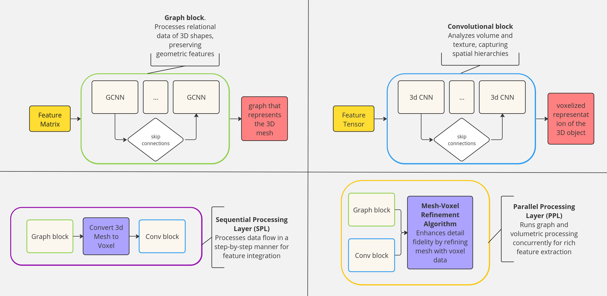
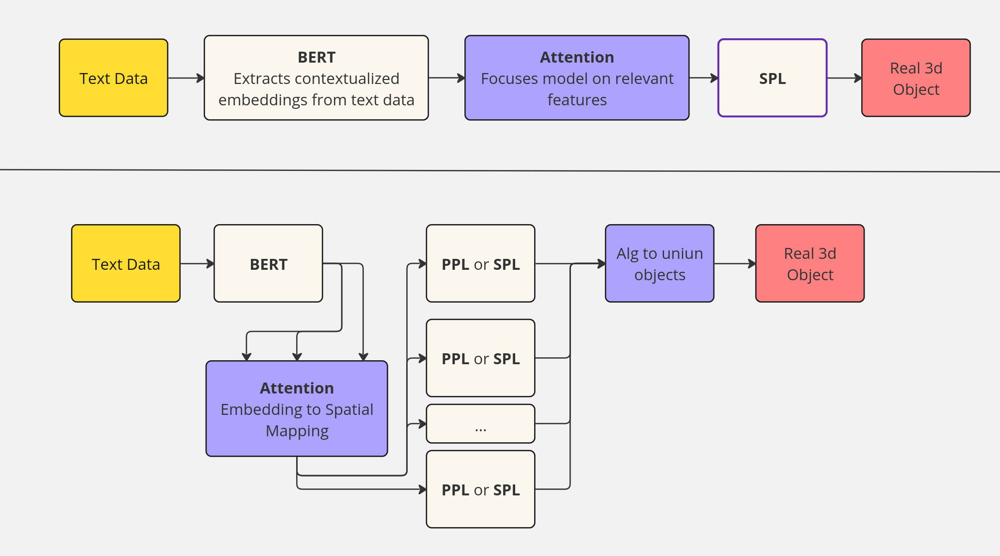

# Text-to-3D Mesh AI Project Report
## Introduction 🌐
### Project Idea

The goal of this project is to create realistic 3D meshes from text descriptions, utilizing a novel combination of Graph and 3D Convolutional Neural Networks. This approach aims to bridge the gap in current AI capabilities, moving beyond 2D image generation to consider three-dimensional relationships.

### Challenges Addressed

Varied and Poorly Structured Data: Tackled through data augmentation and synthesis techniques.
High Memory and Computation Requirements: Utilizing the power of Google Cloud Storage combined with the Colab environment.
Complex Model Architecture: Deep research and extensive experimentations are required.
Time-Intensive Fine-Tuning: An ongoing challenge with no immediate solution.

## Methodology 🧠🛠️
### Tech Stack

Data Storage and Management: MySQL, Google Cloud
3D Processing and Visualization: Open3D
Network Analysis: NetworkX
Machine Learning Frameworks: PyTorch, torch.geometric
Data Visualization: Matplotlib, Plotly
Programming Language: Python (supplemented by libraries like Numpy)

### Data Preparation

The initial stage of data handling involved acquiring multiple open-source datasets which were then normalized. The structured data is stored within a MySQL database, applying various formats necessary for different stages of processing: .ply for mesh structures, .pt for graph representations, and .bin for storing voxelized data.

To enhance the robustness of the model and to address the issue of poor class distribution, I've chosen a set of augmentation algorithms. These algorithms are selected to enrich the dataset, ensuring that the model trains on high-quality input.

Once the initial models show sufficient results, the phase of data synthesis begins. One of the potential approaches is Variational Autoencoders (VAE) which are able to to generate new data instances that capture the complex variations within the training set. As a result, a richer dataset for advanced model training would be achived.

### Model Architecture and Training Process

The architecture can be described in two stages: base blocks (Figure 1) and high-level structure (Figure 2).

Base blocks include Graph Neural Networks (GNNs) for understanding the geometric features of 3D shapes and 3D CNNs for analyzing volume and texture. Initially, the focus is on training base blocks separately. This strategy keeps computational complexity on lower level, allows tuning parameters and interpreting future outputs. The focus is on fine-tuning the GNNs and the 3D CNNs to accurately process and interpret geometric data and textures. To achieve this, Variational Autoencoders (VAE) and Generative Adversarial Networks (GAN) are being employed.

For the high-level architecture, BERT is employed to extract contextual embeddings from text data, which then inform the GNNs and 3D CNNs. This high-level architecture guides the developemnt of the base blocks. The more granular structure will be defined at a later stage.

{ width="100" }
Figure 1: Base Blocks of the Model Architecture.

{ width="100" }
Figure 2: High-Level Architecture of the Model.

## Conclusion & Learning 🤔🚀
### Personal Highlights

Key learnings from managing a complex, multi-faceted AI project, encompassing both technical and project management skills.

## Project Team 👥

As the sole contributor to this project, I have undertaken all roles, including research, development, and project management.

    GitHub Repository: https://github.com/maykitbo/3d_mesh_neural_network
    LinkedIn Profile: https://www.linkedin.com/in/oleksii-zamyrailov-200997260/